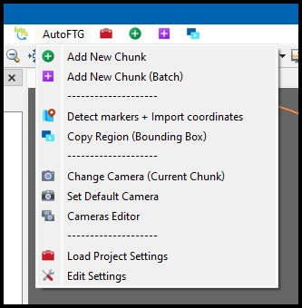

# AutoFTG

*Python scripts for AgiSoft Metashape Pro.* 

Version: **2.1.0-beta**

###### Compatible with Metashape Pro version: 1.8.x and 2.0.x

---

## Description

Scripts for process automation in Agisoft Metashape Pro.

This is an assembly of existing scripts from other users, and some additional scripts written for use in work process at project 2TIR, tunnel T8-KP in Slovenia.

Author: Boris Bilc (Slovenia)

### Menu Screenshot

 
*Preview of AutoFTG menu in Metashape Pro* 

---

## Installation

These scripts require additional configuration to run. 
Please note that these instructions apply only to Windows 7/8/10/11 systems.

### Requirements

You must have Python and OpenSSL installed on your system, and system enviroment PATH pointing to locations where they are installed. This is needed to be able to install additional python modules that are needed to run AutoFTG scripts.

Following are things to install for properly running AutoFTG script. 
Provided are links to setup files for proper versions that need to be installed.

- [Python 3.9.13](https://www.python.org/ftp/python/3.9.13/python-3.9.13-amd64.exe) (current python version provided in Metashape)
- [OpenSSL 1.1.x](https://slproweb.com/products/Win32OpenSSL.html) (install only one version x86/x64, and DO NOT install Lite versions)
- Set enviroment PATH for Python and OpenSSL
- Python modules: **easygui**

### Configure Metashape Python

To be able to install modules in python that is embeded in Metashape we need to copy some files from Python installation described in previous chapter.

Copy following files from/to locations described bellow...

- libcrypto-1_1.dll
- libssl-1_1.dll

**From folder:** `C:\Users\[current user]\AppData\Local\Programs\Python\Python39\DLLs`

**To folder:** `C:\Program Files\Agisoft\Metashape Pro\python\DLLs`

After you copied DLL's you can continue with python module installation. 
Open Command Prompt/Terminal and navigate to Metashape python location.

`cd "C:\Program Files\Agisoft\Metashape Pro\python"`

Next run the following command to install easygui module:

`python.exe -m pip install easygui`

Done! Module easygui is now installed, and you can use AutoFTG script now.

---

## References

Following are references to code samples/examples that are used in AutoFTG scripts.

**Agisoft GitHub repository** 
https://github.com/agisoft-llc/metashape-scripts

**Copy Bounding Box Script** 
https://github.com/agisoft-llc/metashape-scripts/blob/master/src/copy_bounding_box_dialog.py

