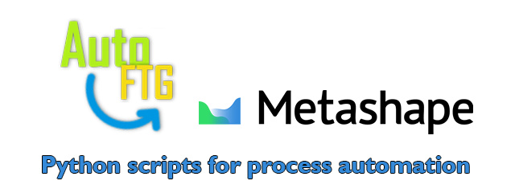
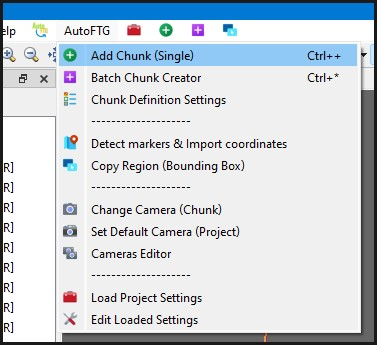
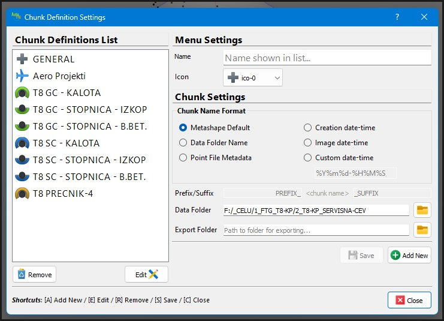
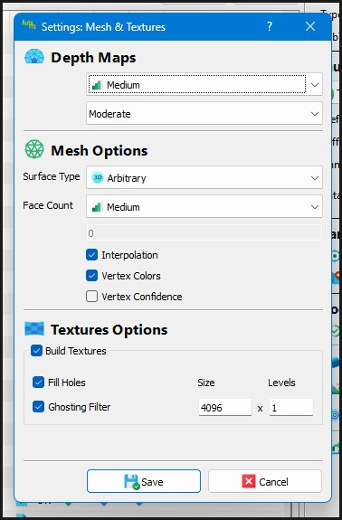
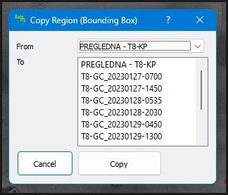
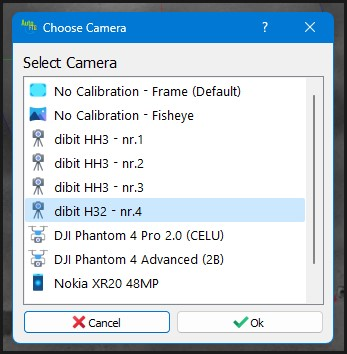
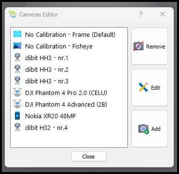

# AutoFTG

*Python scripts for AgiSoft Metashape Pro.* 

> Compatible with Metashape Pro version 2.0.x

---

## Description

**AutoFTG - Scripts for Agisoft Metashape Pro**

This is an assembly of python scripts for process automation, and some existing scripts from other users
Scripts were written for use in work process on project 2TDK, construction of railroad tunnels in Slovenia, but were later modified to support any kind of project where lots of processing is needed.

Author: Boris Bilc (Slovenia)

### Screenshots

*Preview of AutoFTG menu in Metashape Pro & Create New Chunk (Single)* 

") 

*Batch Chunk Creator* 
 

*Chunk Definition Editor* 
 

*Model Processing Settings* 
 

*Copy Region Dialog* 
 

*Select Default/Chunk Camera* & *Cameras Editor* 
 

---

## Installation

These scripts require additional configuration to run. 
Please note that these instructions apply only to Windows 7/8/10/11 systems.

### Requirements

You must have Python 3.9.13, and OpenSSL 1.1.x installed on your system, with system enviroment PATH pointing to locations where they are installed. This is needed to be able to install additional python modules that are needed to run AutoFTG scripts.

Following are things to you need to properly run AutoFTG scripts. 
Provided bellow are links to downloads for proper versions you need to install.

- [OpenSSL 1.1.x](https://slproweb.com/products/Win32OpenSSL.html) (install only one version x86/x64, and DO NOT install Lite versions)
- [Python 3.9.13 (x64)](https://www.python.org/ftp/python/3.9.13/python-3.9.13-amd64.exe) ([Page](https://www.python.org/downloads/release/python-3913/)) (current python version provided in Metashape)
- Set enviroment PATH for Python and OpenSSL
- Python modules: **easygui**

### Configure Metashape Python

To be able to install modules in python that is embeded in Metashape we need to copy some files from Python installation described in previous chapter.

**1.** Copy following files from/to locations described bellow...

- libcrypto-1_1.dll
- libssl-1_1.dll

  - **From folder:** `C:\Users\<username>\AppData\Local\Programs\Python\Python39\DLLs`

  - **To folder:** `C:\Program Files\Agisoft\Metashape Pro\python\DLLs`

**2.** Open Command Prompt/Terminal and navigate to Metashape python location.

`cd "C:\Program Files\Agisoft\Metashape Pro\python"`

**3.** Run the following command to install easygui module:

`python.exe -m pip install easygui`

Done! Module **easygui** is installed, now you can continue to AutoFTG scripts download and installation.

**4.** [Download](https://github.com/bilkos/AutoFTG-Scripts_Metashape-Pro/releases) latest version of AutoFTG scripts, and extract archive to Metashape user-scripts location.

Folder location: `C:\Users\<username>\AppData\Local\Agisoft\Metashape Pro\scripts`

**5.** Run Metashape (**as Administrator**), and enjoy!
  

> Thank you for using AutoFTG Scripts for Agisoft Metashape Pro.

---

## References

Following are references to code samples/examples that are used in AutoFTG scripts.

**Agisoft GitHub repository** 
https://github.com/agisoft-llc/metashape-scripts

**Copy Bounding Box Script** 
https://github.com/agisoft-llc/metashape-scripts/blob/master/src/copy_bounding_box_dialog.py

